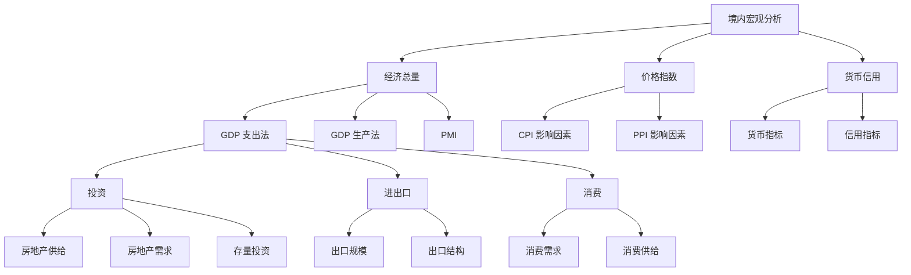

# 宏观数据跟踪框架

## 1. 宏观数据框架

---

## 2. 宏观数据目录

### 1. 经济总量

- **GDP支出法**
  - 同比：实际值与目标值
  - 三驾马车对GDP拉动与贡献
  - 人均GDP
- **GDP生产法**
  - 分产业（第一/第二/第三产业）
  - 增速与结构
- **景气度（PMI）**
  - PMI分项指标（订单、库存等）
  - 宏观经济景气判断  
  - 企业景气度  
  - 库存周期波动

---

### 2. 价格

- **CPI**
  - 同比变化  
  - 结构拆分  
  - 驱动因素（如CRB、猪周期等）
- **PPI**
  - 同比变化  
  - 主要商品价格  
  - 上下游传导
- **价格指数（补充）**
  - 农产品价格变化  
  - 工业品价格变化

---

### 3. 工业与消费

- **工业**
  - 工业增加值  
  - 产量指标  
  - 重点行业表现（如电力等）
- **消费**
  - 社会消费品零售总额  
  - 消费结构变化  
  - 人口收入与消费

---

### 4. 投资与房地产

- **投资**
  - 固定资产投资（基建 / 制造 / 房地产）  
  - 投资完成额
- **房地产**
  - 房地产开发与销售  
  - 新开工 / 施工 / 销售面积  
  - 房价指数  
  - 土地市场

---

### 5. 财政与民生

- **就业**
  - 城镇调查失业率  
  - 就业结构
- **财政收支**
  - 财政收入  
  - 财政支出  
  - 赤字情况
- **其他**
  - 居民收入  
  - 民生相关指标

---

### 6. 进出口

- 进出口总额  
- 出口 / 进口  
- 贸易结构  
- 汇率影响  
- 外资（引进外资 / 对外投资）

---

### 7. 货币

- M0  
- M1  
- M2  
- M1-M2 剪刀差

---

### 8. 信用（社融与信贷）

- **社融**
  - 同比 / 环比  
  - 结构拆分
- **信贷**
  - 同比 / 环比  
  - 投向结构

---

## 备注（重要）

- 上述框架本质是：
  > **经济 → 通胀 → 流动性（信用） 三大主线**
- 可直接映射到你的智能投顾体系：
  - 经济 → 股票
  - 通胀 → 商品/黄金
  - 利率/信用 → 债券
  - 流动性 → 现金

---

## 一句话评价（帮你校准）

这套框架本质是一个：

> **“卖方宏观研究标准模板（弱量化版）”**

优点：

- 全覆盖（适合研究报告）

问题：

- **维度过多，不适合直接喂给量化模型**
- 存在：
  - 指标冗余（PMI vs 工业 vs GDP）
  - 口径不统一
  - 无“资产映射”

